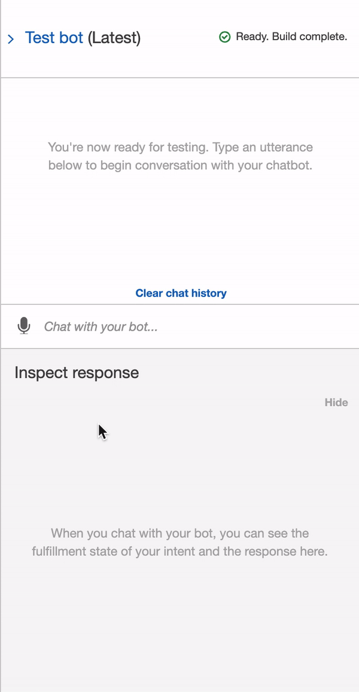
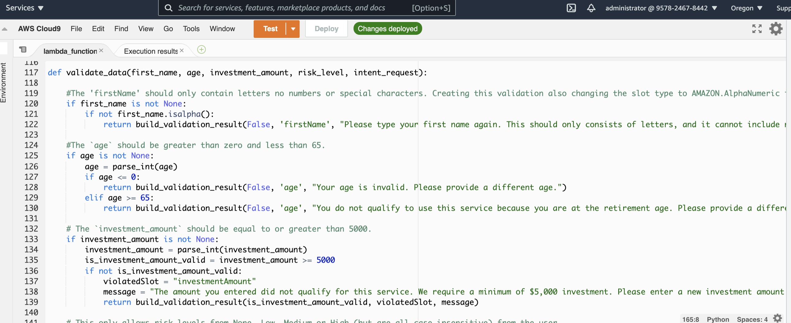
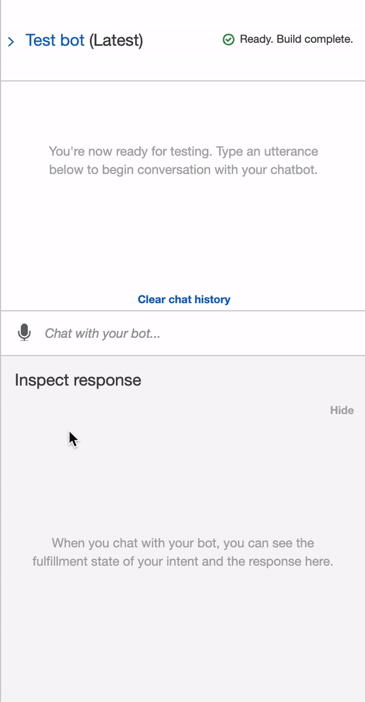

# **Module 15 Challenge: RoboAdvisor**

## Table of Contents

[RoboAdvisor Overview](https://github.com/juzcho/Module_15_Challenge_RoboAdvisor#roboadvisor-overview)

[Technologies](https://github.com/juzcho/Module_15_Challenge_RoboAdvisor#technologies)

[Installation Guide](https://github.com/juzcho/Module_15_Challenge_RoboAdvisor#installation-guide)

[Examples](https://github.com/juzcho/Module_15_Challenge_RoboAdvisor#examples)

[Usage](https://github.com/juzcho/Module_15_Challenge_RoboAdvisor#usage)

[Contributors](https://github.com/juzcho/Module_15_Challenge_RoboAdvisor#contributors)

[License](https://github.com/juzcho/Module_15_Challenge_RoboAdvisor#license-1)

---

## RoboAdvisor Overview

This project is about creating a RoboAdvisor for current and new customers looking to understand their investment portfolio recommendation for their retirement. It has been launched with the use of AWS Lex so users can have a smoother experience.

---

## Technologies

This project leverages **[python version 3.8.5](https://www.python.org/downloads/)** with the following packages and modules:

* [datetime](https://docs.python.org/3/library/datetime.html)
  *  [dateutil](https://dateutil.readthedocs.io/en/stable/index.html)

* [AWS Lambda](https://aws.amazon.com/lambda/) - To build the functionality for the tool.

* [AWS Lex](https://aws.amazon.com/lex/) - A service for building conversational interfaces into any application using voice and text. This was used in combination with the functionality created on AWS Lambda.
 
* [Logging](https://docs.python.org/3/howto/logging.html)

* [Numpy](https://numpy.org/) - This provides the ability to work with arrays and use different mathematical calculations on arrays.

---
## Installation Guide

### 1. Create [AWS](https://aws.amazon.com/) free account to access AWS Lambda and AWS Lex. 

### 2. Use VSCODE to view and edit lambda_function.py file.

---
## Examples

Here are some of the data we did for this model.

### **This gif should show both correct and incorrect chatbot prompts:** 

---

## Usage

### To use the AWS Lambda function:

1. Go to AWS Lambda first. Create a new Lambda function from scratch, and name it recommendPortfolio. Choose Python 3.7 as the runtime programming language.

2. In the online code editor, delete the AWS-generated default lines of code, and then paste the new lambda_function.py that is provided with this file. 

---
### To use the AWS Lex Chatbot, our RoboAdvisor Investment Recommendation:

1. The user needs to input an utterance first i.e *"I want to invest for my retirement"*, then it will prompt to input his/her first name.
2. Then, it will ask for your age. Your age needs to be below the retirement age. 
3. Then, it will ask how much amount you want to invest, which needs to be at least $5,000.
4. Then, it will ask how much risk you can handle i.e none, low, medium or high.
5. Then, once you make a confirmation to proceed, it will share you your potential investment recommendation.

### **This shows just the correct chatbot prompts:**

---

## Contributors

Contributed by: Justine Cho

Email: juz317_cho@yahoo.com

[ LinkedIn](https://www.linkedin.com/in/justinecho)

---

## License

### **MIT License**

Copyright (c) [2021] [Justine Cho]

Permission is hereby granted, free of charge, to any person obtaining a copy
of this software and associated documentation files (the "Software"), to deal
in the Software without restriction, including without limitation the rights
to use, copy, modify, merge, publish, distribute, sublicense, and/or sell
copies of the Software, and to permit persons to whom the Software is
furnished to do so, subject to the following conditions:

The above copyright notice and this permission notice shall be included in all
copies or substantial portions of the Software.

THE SOFTWARE IS PROVIDED "AS IS", WITHOUT WARRANTY OF ANY KIND, EXPRESS OR
IMPLIED, INCLUDING BUT NOT LIMITED TO THE WARRANTIES OF MERCHANTABILITY,
FITNESS FOR A PARTICULAR PURPOSE AND NONINFRINGEMENT. IN NO EVENT SHALL THE
AUTHORS OR COPYRIGHT HOLDERS BE LIABLE FOR ANY CLAIM, DAMAGES OR OTHER
LIABILITY, WHETHER IN AN ACTION OF CONTRACT, TORT OR OTHERWISE, ARISING FROM,
OUT OF OR IN CONNECTION WITH THE SOFTWARE OR THE USE OR OTHER DEALINGS IN THE
SOFTWARE.
